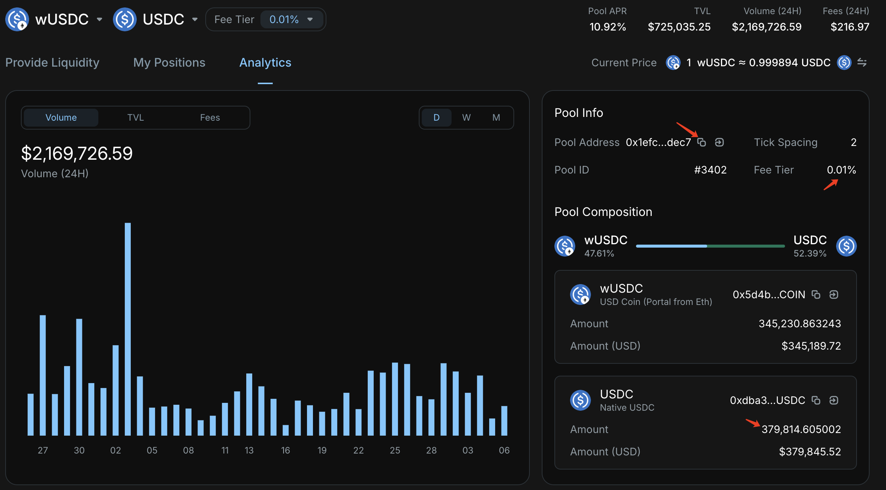
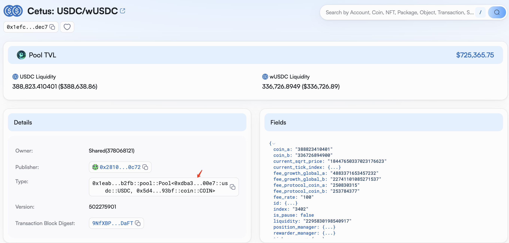

# Flash Loans

## Fees

Cetus Protocol supports flash loans using assets from Pools. The borrowing fee is consistent with the pool's trading fee, with a minimum of 0.0001.

Cetus currently has six fee tiers.

tick spacing | fee rate
--|--
2 | 0.0001  (100)
10 | 0.0005 (500)
20 | 0.001 (1000)
60 | 0.0025 (2500)
200 | 0.01 (10000)
220 | 0.02 (20000)

## Lookup
For example, to borrow USDC via a flash loan, prioritize finding a pool with a fee rate of 0.01% to reduce costs. In Cetus's pools, locate the 0.01% wUSDC/USDC pool.



In this pool, there are several key pieces of information. The "Fee tier" indicates a rate of 0.01%. The "Pool Composition" shows the amount of USDC available for borrowing. The pool address `0x1efc96c99c9d91ac0f54f0ca78d2d9a6ba11377d29354c0a192c86f0495ddec7` can be copied and opened in the explorer.  


Since USDC is listed first, it is considered CoinA. If it were listed second, it would be CoinB. Record the address of CoinA as `0xdba34672e30cb065b1f93e3ab55318768fd6fef66c15942c9f7cb846e2f900e7::usdc::USDC` and CoinB as `0x5d4b302506645c37ff133b98c4b50a5ae14841659738d6d733d59d0d217a93bf::coin::COIN`. These will be used later.

## Code

Refer to the [developer documentation](https://cetus-1.gitbook.io/cetus-developer-docs/developer/via-contract/features-available/flash-loan) to write flash loan code.
The package should be filled with the latest contract address, which can be found in the `published-at` section of the [GitHub link](https://github.com/CetusProtocol/cetus-clmm-interface/blob/main/sui/cetus_clmm/Move.toml). From the [explorer](https://suivision.xyz/package/0xc6faf3703b0e8ba9ed06b7851134bbbe7565eb35ff823fd78432baa4cbeaa12e?tab=Code), you can see that the flash loan-related functions are located under the `pool` module. The `GlobalConfig` ObjectId is `0xdaa46292632c3c4d8f31f23ea0f9b36a28ff3677e9684980e4438403a67a3d8f`.
[flashloan.ts](../example_projects/flashloan.ts) is an example code snippet for using flash loans.


### Calculating Fees

Assuming we want to borrow an amount of `987654321`, the fee to be returned is the borrowed amount multiplied by the fee rate, rounded up.

```TypeScript
function getFee(input: number, feeTier: number): number {
    if (typeof input !== 'number') {
        throw new Error('Input must be a number');
    }

    const result = input * feeTier / 1_000_000;
    return Math.ceil(result);
}

const amount: number = 987654321;
const fee: number = getFee(amount, 100);
```

`getFee` is a function that calculates the flash loan fee based on the borrowed amount and fee rate. The fee rate input can be referenced from the table above, for example, 0.0001 is input as 100.

### Loan

```TypeScript
const tx = new Transaction();
const [balanceA, balanceB, flreceipt] = tx.moveCall({
    package: PACKAGE,
    module: "pool",
    function: "flash_loan",
    arguments: [
        tx.object(GlobalConfig),
        tx.object(Pool),
        tx.pure(bcs.bool().serialize(true).toBytes()),
        tx.pure(bcs.u64().serialize(amount).toBytes()),
    ],
    typeArguments: [
        CoinAType,
        CoinBType,
    ],
});
// do sth
```
Borrow the flash loan and perform actions to obtain profit. The input parameters correspond to the interface documentation.

```rust
public fun flash_loan<CoinTypeA, CoinTypeB>(
    _config: &GlobalConfig,
    _pool: &mut Pool<CoinTypeA, CoinTypeB>,
    _loan_a: bool,
    _amount: u64
): (Balance<CoinTypeA>, Balance<CoinTypeB>, FlashLoanReceipt) {}
```
Since we are borrowing CoinTypeA, the `loan_a` parameter is set to `true`. If we were borrowing CoinTypeB, the `loan_a` parameter would be set to `false`.

### Repayment

```TypeScript
const [reBalance] = tx.moveCall({
    package: "0x2",
    module: "balance",
    function: "split",
    arguments: [
        balanceA,
        tx.pure(bcs.u64().serialize(amount + fee).toBytes()),
    ],
    typeArguments: [
        CoinAType,
    ],
});

tx.moveCall({
    package: PACKAGE,
    module: "pool",
    function: "repay_flash_loan",
    arguments: [
        tx.object(GlobalConfig),
        tx.object(Pool),
        reBalance,
        balanceB, 
        flreceipt,
    ],
    typeArguments: [
        CoinAType,
        CoinBType,
    ],
});
```

Split the balance to repay the flash loan.

```TypeScript
const [profit] = tx.moveCall({
    package: "0x2",
    module: "coin",
    function: "from_balance",
    arguments: [
        balanceA,
    ],
    typeArguments: [
        CoinAType,
    ],
});

tx.moveCall({
    package: "0x2",
    module: "transfer",
    function: "public_transfer",
    arguments: [
        profit,
        tx.pure(bcs.Address.serialize(address).toBytes()),
    ],
    typeArguments: [
        "0x2::coin::Coin<"+CoinAType+">",
    ],
});
```

Transfer the remaining profit to the user's address.   
In more specific projects, adjustments to the code may be necessary depending on whether CoinA or CoinB is borrowed.